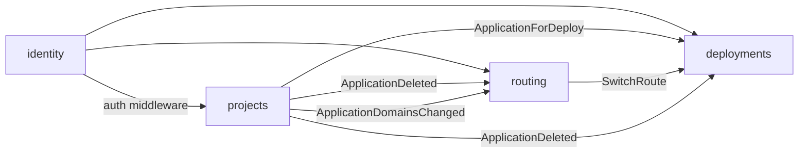

# Context map

The bounded contexts in this project, which unit hosts each one, and how they
depend on each other.

## Contexts

| Context | Subdomain | Hosted in | Owns |
| ------- | --------- | --------- | ---- |
| deployments | core | `services/api` (`contexts/deployments`) | Deployments, their logs, talking to Podman (builds, containers) |
| projects | supporting | `services/api` (`contexts/projects`) | Projects, Environments, Applications, Env vars |
| routing | supporting | `services/api` (`contexts/routing`) | Routes, Route settings and the Proxy (the Caddy container and its config) |
| identity | generic | `services/api` (`contexts/identity`) | The Owner, Setup, Sessions |

- **Core:** where the project competes. Gets the most care and the richest model.
- **Supporting:** needed and specific to this project, but not the differentiator.
- **Generic:** solved problems (auth, billing, email). Prefer buying or reusing
  over building.

## Relationships

One row per dependency. Upstream is the side whose model the other has to
adapt to.

| Upstream | Downstream | Pattern | Through |
| -------- | ---------- | ------- | ------- |
| identity | projects, deployments, routing | open host service | The `auth` HTTP middleware; the others only learn "an Owner is signed in" |
| projects | deployments | customer/supplier | `projects.ApplicationForDeploy(id)` returns an `ApplicationSnapshot` (Source, Dockerfile path, port, Domains, Persistent storage, Resource limits, decrypted Env vars and Deploy key) |
| projects | routing | customer/supplier | `projects.ApplicationExists(id)`, so the Route settings API answers 404 for an unknown Application without reading projects' tables |
| routing | deployments | customer/supplier | `routing.SwitchRoute(applicationID, domains, container, port)`, called synchronously in a Deployment's route step, so the old Container is removed only after traffic has moved |
| projects | routing, deployments | published language | `ApplicationDeleted` event: routing drops the Application's Route and Route settings; deployments removes its Containers, volumes, Deployments and Webhook |
| projects | routing | published language | `ApplicationDomainsChanged { applicationID, domains }` event: routing moves the Application's Route to the new Domains at once |

Patterns: *customer/supplier*, *conformist*, *anticorruption layer*,
*open host service* / *published language*, *shared kernel*, *separate ways*.
A shared kernel is a deliberate exception and needs a line saying why.

## Diagram

