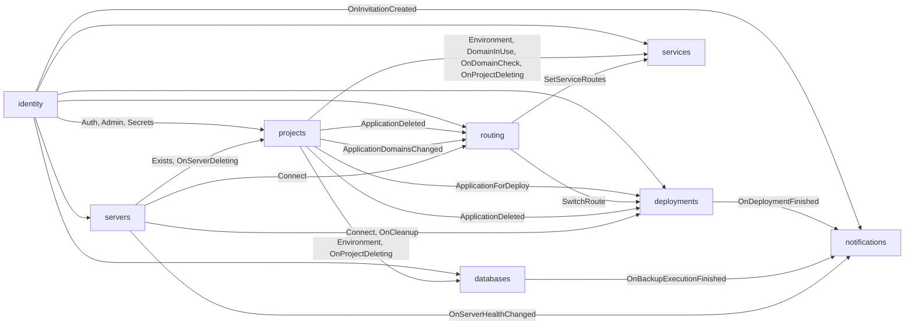

# Context map

The bounded contexts in this project, which unit hosts each one, and how they
depend on each other.

## Contexts

| Context | Subdomain | Hosted in | Owns |
| ------- | --------- | --------- | ---- |
| deployments | core | `services/api` (`contexts/deployments`) | Deployments, their logs, Webhooks, Previews and Known hosts, talking to Podman (builds, containers) |
| projects | supporting | `services/api` (`contexts/projects`) | Projects, Environments, Applications, Environment variables |
| routing | supporting | `services/api` (`contexts/routing`) | Routes, Service routes, Route settings and the Proxies (a Caddy container per Server and its config) |
| databases | supporting | `services/api` (`contexts/databases`) | Databases, their Containers and volumes, Scheduled backups, Backup executions and S3 storages |
| services | supporting | `services/api` (`contexts/services`) | Services, their Components, networks, volumes and Service variables, and the Service templates |
| servers | supporting | `services/api` (`contexts/servers`) | Servers, their Private keys and Host keys, Server connections, Validation, metrics and Cleanup |
| identity | generic | `services/api` (`contexts/identity`) | Members and their Roles, Setup, Invitations, Sessions, API tokens, Profiles and Two-factor authentication |
| notifications | generic | `services/api` (`contexts/notifications`) | Notification channels and their Deliveries |

- **Core:** where the project competes. Gets the most care and the richest model.
- **Supporting:** needed and specific to this project, but not the differentiator.
- **Generic:** solved problems (auth, billing, email). Prefer buying or reusing
  over building.

## Relationships

One row per dependency. Upstream is the side whose model the other has to
adapt to.

| Upstream | Downstream | Pattern | Through |
| -------- | ---------- | ------- | ------- |
| identity | projects, deployments, routing, databases, services, servers, notifications | open host service (they are conformist) | The `identity.Auth` middleware (a signed-in Member, by Session or API token; viewers refused on every change), `identity.Admin` around admin-only areas, `identity.Secrets` around GETs that return Secrets, and `identity.CanSeeSecrets(ctx)` where one response mixes Secrets with public fields. The others learn nothing else about Members |
| projects | deployments | customer/supplier | `projects.ApplicationForDeploy(id)` returns an `ApplicationSnapshot` (Target server, Git repository, Dockerfile path, port, Domains, Persistent storage, Resource limits, decrypted Environment variables and Deploy key) |
| projects | routing | customer/supplier | `projects.ApplicationExists(id)`, so the Route settings API answers 404 for an unknown Application without reading projects' tables |
| routing | deployments | customer/supplier | `routing.SwitchRoute(serverID, applicationID, domains, container, port)`, called synchronously in a Deployment's route step, so the old Container is removed only after traffic has moved; `routing.SwitchPreviewRoute(serverID, applicationID, preview, domains, container, port)` the same for a Preview, and `routing.DropPreviewRoute(applicationID, preview)` when a Preview closes |
| projects | routing, deployments | published language | `ApplicationDeleted` event: routing drops the Application's Route, Preview routes and Route settings; deployments removes its Containers, volumes, Deployments, Previews and Webhook |
| projects | databases | customer/supplier | `projects.Environment(id)` places a new Database and names its Project; `projects.OnProjectDeleting` lets databases refuse deleting a Project that still has Databases |
| projects | routing | published language | `ApplicationDomainsChanged { applicationID, domains }` event: routing moves the Application's Route to the new Domains at once |
| projects | services | customer/supplier | `projects.Environment(id)` places a Service; `projects.DomainInUse(domain)` before a Service stores a Domain; services registers `projects.OnDomainCheck` (an Application cannot take a Service's Domain) and `projects.OnProjectDeleting` (a Project with Services is not deleted) |
| routing | services | customer/supplier | `routing.SetServiceRoutes(serviceID, routes)` after a Service is Up, `routing.DropServiceRoutes(serviceID)` before it is deleted |
| servers | deployments | customer/supplier | `servers.Connect(serverID)` gives the Server connection every step of a Deployment runs through; deployments registers its Image retention with `servers.OnCleanup`, called with the Server's id during every Cleanup |
| servers | routing | customer/supplier | `servers.Connect(serverID)` to run and configure the Proxy of a Remote server |
| servers | projects | customer/supplier | `servers.Exists(id)` when an Application is created with a Target server; projects registers `servers.OnServerDeleting` so a Server Applications target is not deleted |
| deployments | notifications | published language | `deployments.OnDeploymentFinished { deployment, application, slug, succeeded, reason, branch, commit, trigger, rollback }`: a Deployment ended succeeded or failed (not cancelled, not failed by a restart) |
| databases | notifications | published language | `databases.OnBackupExecutionFinished { backup execution, database, name, type, succeeded, reason, trigger, size, off-site }`: a Backup execution ended (not one failed by a restart) |
| servers | notifications | published language | `servers.OnServerHealthChanged { server, name, change, reason, disk used/total }`: a Server probe found a Server unreachable, reachable again, or its disk usage high |
| identity | notifications | customer/supplier | `identity.OnInvitationCreated { email, role, invited by, link, expires }`, called synchronously; notifications answers whether it emailed the link |

## External systems

| System | Used by | Through |
| ------ | ------- | ------- |
| Podman (rootless libpod API) | deployments, routing, databases, services, servers | Bakery's own thin client in `app/podman`, over the local socket or tunnelled over SSH |
| SSH | servers (for deployments and routing through Server connections) | `golang.org/x/crypto/ssh`: Podman's socket and the Remote Proxy's admin socket through `direct-streamlocal` channels, plain commands for checks |
| Caddy admin API | routing | JSON config loaded with `POST /load` |
| S3-compatible storage | databases | Its own thin S3 client (Signature V4), for Backup executions |
| Git hosts' REST APIs (Forgejo and Gitea, GitHub, GitLab) | deployments | Plain HTTPS calls with the Git host token, to write the Preview comment |
| SMTP servers | notifications | `net/smtp`, with the settings of an email Notification channel |
| Discord, Slack, Telegram, ntfy, webhook receivers | notifications | Plain HTTPS POSTs, one small sender per Channel kind |

Patterns: *customer/supplier*, *conformist*, *anticorruption layer*,
*open host service* / *published language*, *shared kernel*, *separate ways*.
A shared kernel is a deliberate exception and needs a line saying why.

## Diagram

